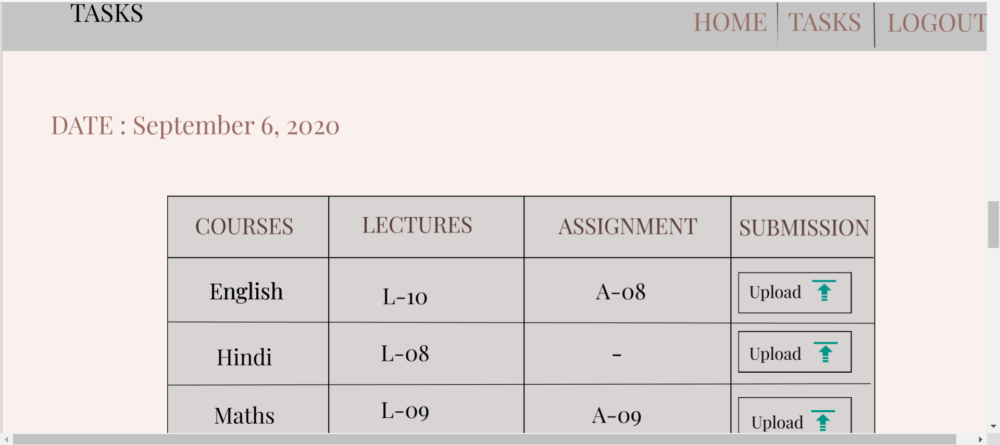

# PROJECT NAME
siStars School Portal - Four walls of internet and tomorrow inside!

## PROJECT DESCRIPTION
siStar is an online portal where every student can attend the school with the leisure of staying at home.

# Code description 
mydb.db has the structure of our database. It includes:
- a Course table having details of the courses offered (listed 4 courses)
- Vidoes table for each course offered
- Assignments table for each course offered

Note: addition of a new course requires modifications on the backend

## myAdmin.ipynb
It contains functions useful for teachers/admin. Following is the list of functions:
- view_course_details to view details of the courses offered
- select_all_asgnmts to show all assignments of a course
- select_all_videos to show all videos of a course
- add_to_assignments addition of new video in a particular course
- add_to_videos addition of new video in a particular course

## student.ipynb
It contains functions view_course_details, select_all_asgnmts, select_all_videos. In addition to these, it also contains the following functions:
- watch_video to set status of a video of a course as 'YES'(completed)
- do_assignment to set status of a assignment of a course as 'YES'(completed)

This code has all the functions useful for a student. The program is set such that it looks for assignments whose deadlines are near and the video lecture that needs to be watched before submission. For instance, if an assignment is dependent on the lecture number 5 of a course then it has to watch lecture 5 but only after making sure that all the lectures before it (here, lecture 1,2,3 and 4) has been watched. 
On Sundays, the codes looks for the assignments whose deadlines have crossed or is to be submitted on the present day and suggests the student to watch the videos required. If there's no such case then the student gets a 'No work day!'
Each day the student has to choose the number of tasks she/he wants to do. 

# Key Highlights 
1. It ensures about the availability of courses or schooling to every child irrespective of number of children in the family.
2. mainly focuses on the education outreach rather than emphasising more the attendance criteria. Students can have the
flexibility of attendance which would be based on the submission of graded assignments given by respective course instructors.

## NOTE -
Name used is just for the sample. It does not intentionally points to a specific person.

